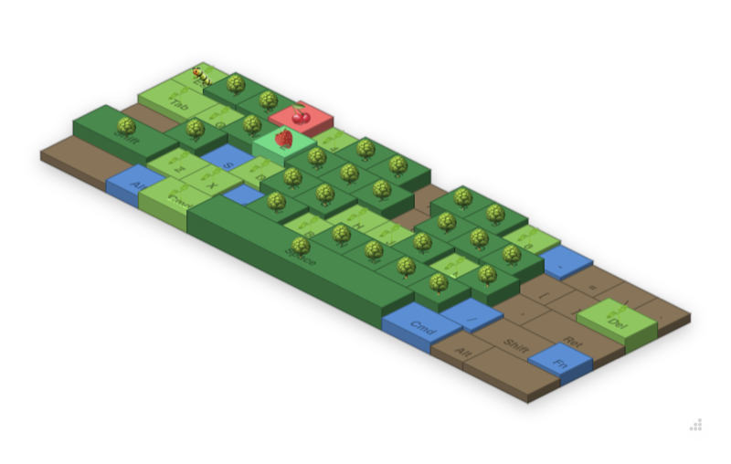
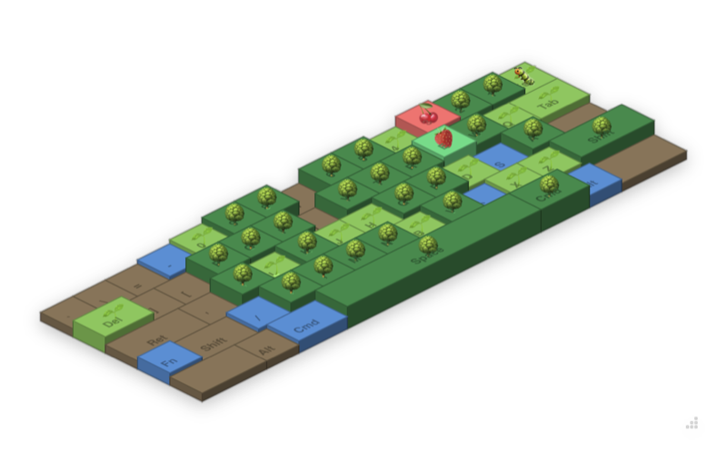
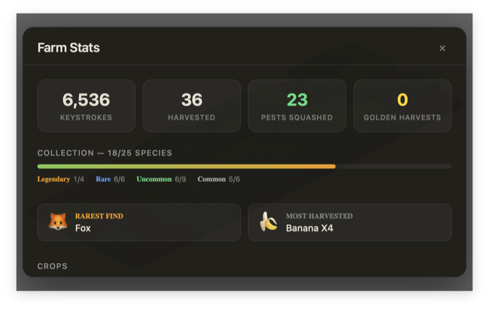
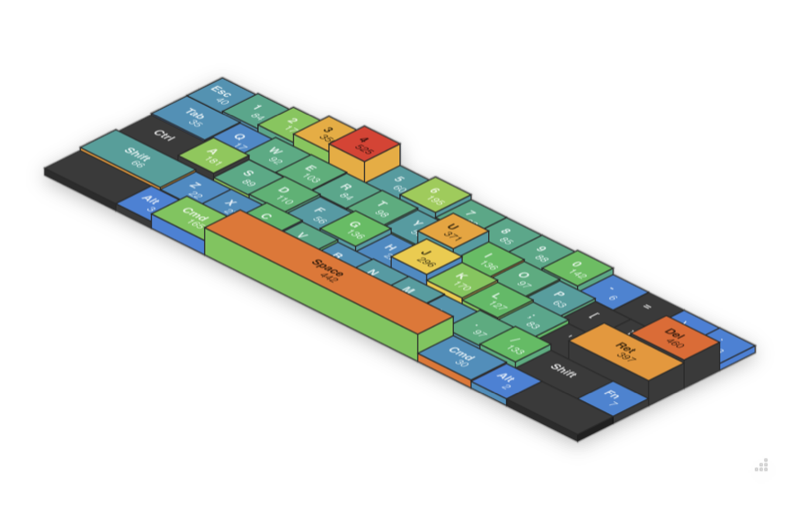

# KeyFarm

Your keyboard is a farm. Every keystroke grows crops.

KeyFarm is a desktop app that turns your daily typing into a tiny farming game. It sits in the corner of your screen, listening to your keyboard — each key is a plot of land on an isometric farm that grows through stages as you type.

<p align="center">
  
</p>

## Download

Go to the [Releases](https://github.com/t42ji2ji/keyfarm/releases) page and download the latest version for your platform:

- **macOS** — `KeyFarm_x.x.x_universal.dmg`
- **Windows** — `KeyFarm_x.x.x_x64-setup.exe`

> macOS users: After opening the DMG, drag KeyFarm to Applications. On first launch, right-click the app and select "Open" to bypass Gatekeeper.

## How It Works

Your keyboard is mapped as an HHKB-layout farm grid. When you press a key, the corresponding plot grows:

1. **Empty** → 3 presses → **Watering** (a random crop is assigned)
2. **Watering** → 8 presses → **Sprout**
3. **Sprout** → 15 presses → **Tree**
4. **Tree** → 25 presses → **Fruit** (ready to harvest!)

Click a fruiting plot to harvest it. The cycle resets and a new crop begins.

<p align="center">
  
</p>

### Crops & Rarity

There are 25 crops across 4 rarity tiers:

| Rarity | Crops |
|---|---|
| Common | 🍎 🍊 🍋 🍇 🍑 🍒 |
| Uncommon | 🍓 🍉 🍌 🍐 🥝 🐔 🐷 🐮 🐑 |
| Rare | 🥭 🍍 🫐 🐱 🐶 🐰 |
| Legendary | 🦊 🦄 🐉 🐼 |

Every harvest has a **1% chance** of being golden.

<p align="center">
  
</p>

### Heatmap View

Switch to heatmap mode to see which keys you use the most. The height and color of each key reflects your total presses.

<p align="center">
  
</p>

### Farm Events

- **Pests** — Bugs randomly appear on growing crops and block progress. Click to remove them.
- **Fallow** — Harvest the same key 3 times within 10 minutes and the soil needs a 3-minute rest.
- **Overworked** — Mash a key 30 times in 5 seconds and it locks up for 20 seconds.

## Permissions

KeyFarm needs **Accessibility** permission on macOS to detect keystrokes. The app will prompt you to grant this on first launch.

## Development

```sh
npm install
npm run tauri dev
```

Requires [Node.js](https://nodejs.org/) 22+ and [Rust](https://rustup.rs/).
